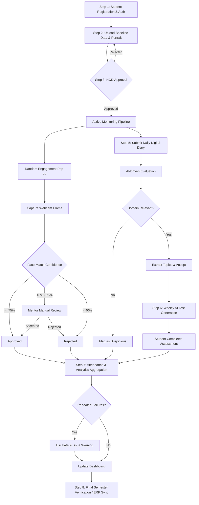

# Project Methodology: InternTrack AI System Flow

This document details the step-by-step operational flow of the InternTrack AI system from start to finish, outlining the specific technologies utilized at each discrete stage of the process.

---

## System Flow Diagram

---

## Step-by-Step Operational Flow

### Step 1: User Registration & Authentication
**Flow:** Users (Students, Mentors, HODs) sign up and log into the system. The backend validates the user identity and issues role-based access tokens to securely segregate user capabilities.
**Technologies Used:**
*   **Firebase Authentication:** Manages the secure sign-up/login processes and generates JWT (JSON Web Tokens).
*   **React (Frontend):** Provides the login forms and routes traffic based on authentication state.
*   **Spring Security & Firebase Admin SDK (Backend):** Intercepts API requests via `JwtFilter`, cryptographically validates the Firebase JWT, and enforces strict Role-Based Access Control (e.g., ensuring a student cannot access HOD approval routes).

### Step 2: Baseline Data Collection
**Flow:** Upon initial login, a student must set up their monitoring profile by taking a baseline reference portrait and declaring their internship domain (e.g., Software Engineering, Data Science).
**Technologies Used:**
*   **React & React Hook Form:** Captures the student's domain input and interfaces with the user's webcam for the initial snapshot.
*   **Firebase Storage:** Securely stores the high-resolution baseline portrait for future biometric comparison.
*   **Google Cloud Firestore:** Persists the user metadata (`users` collection) and domain specifics (`internships` collection) in a NoSQL structure.

### Step 3: HOD Approval Gate
**Flow:** The student's submitted profile enters a pending state. A Head of Department (HOD) logs into their dedicated dashboard to review and approve the student for active tracking.
**Technologies Used:**
*   **React (Frontend):** Renders the HOD pending approval queue.
*   **Spring Boot (Backend):** Exposes secured REST endpoints to update the student's status.
*   **Firestore:** Updates the `status` flag on the student's `internships` document from `PENDING` to `APPROVED`.

### Step 4: Active Monitoring (Real-Time Engagement & Biometrics)
**Flow:** During declared working hours, the system triggers random, unpredictable pop-ups on the student's dashboard. The student must allow webcam access to capture a real-time frame, which is immediately compared against their baseline portrait to verify their physical presence.
**Technologies Used:**
*   **React Service Workers:** Runs in the background to trigger randomized pop-ups without reloading the page or interrupting workflow.
*   **`@vladmandic/face-api` (Client-side AI):** Executes directly within the user's browser to calculate a facial similarity score. This avoids sending heavy, continuous video payloads to the server, preserving bandwidth and privacy.
*   **Spring Boot:** Receives the similarity score and categorizes it (APPROVED >= 75%, BORDERLINE 40-75%, REJECTED < 40%). Borderline checks are sent to Firestore's `mentor_reviews` queue for human validation.

### Step 5: Daily Compliance (Digital Diary & AI Evaluation)
**Flow:** At the end of every working day, the student submits a digital diary detailing their tasks. The system automatically reads the text and evaluates if the logged work is genuinely relevant to their approved internship domain.
**Technologies Used:**
*   **React UI:** Dashboard text editor for diary submission.
*   **Spring Boot (`AiPipelineService`):** The orchestration layer for evaluating logs.
*   **OpenAI / Claude REST API:** The backend constructs a complex LLM prompt to analyze the text. The LLM returns a structured JSON object containing a binary compliance decision (`accept` / `reject`), reasoning, and a list of extracted technical topics.
*   **Java Local Semantic Engine:** A defensive fallback layer that uses local keyword-matching to grade the diary if the external LLM API rate-limits or goes offline.

### Step 6: Validation (Automated Assessment Generation)
**Flow:** To ensure the student is actively learning and not just copying text, a weekly customized quiz is generated. The questions are synthesized directly from the specific technical topics extracted from that student's own accepted diaries over the past week.
**Technologies Used:**
*   **Spring Boot Schedulers (Cron Jobs):** Automatically fires the `WeeklyQuestionGenJob` every weekend.
*   **OpenAI / Claude API:** Prompted by the scheduler to synthesize 5 unique multiple-choice questions based on the accumulated topics array.
*   **Firestore:** Stores the generated quiz securely in the `{uid}_WEEKLY_BANK` collection.
*   **React UI:** Renders the interactive quiz for the student.

### Step 7: Aggregation & Escalation (Attendance & Analytics)
**Flow:** The system continuously collects data from Face-Match popups, AI diary grades, and test scores to compile definitive daily attendance records. If a student repeatedly fails checks (missed popups, off-topic diaries), the system raises flags.
**Technologies Used:**
*   **Spring Boot (`DailyStatusService` & `EscalationService`):** Aggregates daily telemetry, updates the `attendance` collection, and automatically writes warning flags for suspicious patterns.
*   **Firestore:** Serves as the high-speed data aggregation backbone.
*   **Recharts (Frontend):** Powers the HOD and Mentor analytics dashboards, rendering raw database metrics into visual charts to identify non-compliant students at a glance.

### Step 8: Conclusion (Final Verification & Export)
**Flow:** At the end of the academic semester, the system compiles a final, immutable summary of the student's total verified hours, test scores, and compliance status.
**Technologies Used:**
*   **Spring Boot:** Aggregates the final `completion_summaries`.
*   **REST Webhooks (Future Scope):** Pre-designed architectural endpoints intended to synchronize the verified grades directly into the university's main ERP/grading system.
