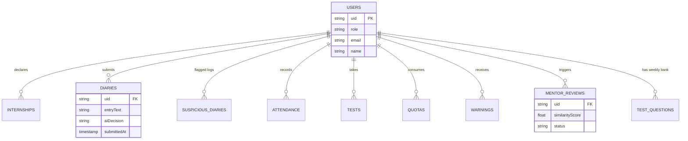

# InternTrack AI - Comprehensive Project Documentation

## --- SECTION 1: PROJECT OVERVIEW ---

**Project Title:** InternTrack AI - Academic Internship Monitoring and Compliance Service

**Problem Statement:** Academic institutions face significant challenges in verifying that students are genuinely participating in their declared internships during required working hours. Traditional methods (manual logbooks, sporadic emails, end-of-semester reports) are easily falsified, provide no real-time oversight, and consume excessive faculty time. There is a critical need for an automated, fraud-resistant system to track, verify, and document student engagement continuously without manual intervention.

**Objective and Scope:** InternTrack AI aims to solve this problem by providing a continuous, automated compliance monitoring platform. 
As implemented, the system scopes:
1. **Three-tiered role access:** Students (submitting logs and verifying attendance), Mentors (reviewing flagged submissions), and HODs (department-wide analytics and oversight).
2. **Automated Engagement Verification:** Randomized daily pop-ups demanding real-time webcam Face-Match verification during declared working hours.
3. **AI-Driven Log Evaluation:** Automated review of daily digital diaries using Natural Language Processing (LLM) to verify domain relevance and continuity, filtering out off-topic submissions.
4. **Adaptive Assessment:** Weekly automated generation of specialized test questions based directly on the student's logged work themes.

---

## --- SECTION 2: TECHNOLOGY STACK (WITH JUSTIFICATION) ---

| Layer | Technology |
|---|---|
| **Frontend UI/UX** | React (v18.2.0), Vite, React Router DOM, React Hook Form, Recharts |
| **Frontend Biometrics** | `@vladmandic/face-api` (v1.7.15) |
| **Backend API** | Java 21, Spring Boot (v3.2.5), Spring Security |
| **Database & Auth** | Firebase Authentication, Google Cloud Firestore, Firebase Admin SDK |
| **AI Integration** | Remote OpenAI/Claude REST API integration (with local semantic fallback) |

**Justifications:**
- **React & Vite:** Chosen for rapid, component-based UI development and fast HMR during the build process. It enables a highly responsive dashboard experience necessary for real-time engagement pop-ups without full-page reloads.
- **Spring Boot & Spring Security:** Selected for robust, enterprise-grade backend stability. Spring Security integrates seamlessly with Firebase JWTs to enforce strict stateless Role-Based Access Control (RBAC) via the `JwtFilter`.
- **Firebase (Auth & Firestore):** Opted for Firebase to offload the security complexity of identity management and credential storage. Firestore's NoSQL document model perfectly suits the hierarchical, schema-less nature of internship logs, reviews, and test sessions.
- **@vladmandic/face-api:** Utilized for executing immediate client-side facial landmark detection and similarity scoring before securely dispatching the telemetry score to the backend, reducing server-side payload overhead (originally designed with AWS Rekognition in mind for optical comparison, current implementation relies on `face-api` similarity scoring).
- **OpenAI/Claude API (with Local Semantic Fallback):** Integrated via direct HTTP REST calls to handle complex natural language understanding for diary review. The system implements a defensive fallback to a local semantic keyword-matching algorithm if the external API rate-limits or the key is unconfigured.

---

## --- SECTION 3: SYSTEM ARCHITECTURE ---

The system implements a modern, decoupled three-layer architecture. The React frontend interacts with the Spring Boot backend via REST APIs. Every request is stateless and secured by Firebase JWTs. The backend validates the JWT, extracts custom role claims, and enforces RBAC before delegating to the service layer. The service layer executes business logic and interfaces with Google Cloud Firestore for data persistence and external LLMs for AI tasks.

```mermaid
flowchart TD
    subgraph Frontend [Client Tier - React / Vite]
        UI[Web Dashboard]
        FaceAPI[@vladmandic/face-api]
        UI -->|Captures Webcam| FaceAPI
        FaceAPI -->|Calculates Similarity Score| UI
    end

    subgraph Backend [Logic Tier - Spring Boot]
        Filter[JwtFilter & Security Context]
        Controllers[REST Controllers]
        Services[Business Logic & Schedulers]
        
        Filter -->|Verified JWT & Role| Controllers
        Controllers --> Services
    end

    subgraph Data & External [Data & AI Tier]
        FirebaseAuth[Firebase Auth]
        Firestore[(Cloud Firestore)]
        LLM[OpenAI / Claude API]
    end

    UI -->|1. Request with Bearer Token| Filter
    Services -->|2. Verify Credentials| FirebaseAuth
    Services -->|3. Read / Write Docs| Firestore
    Services -->|4. Diary Analysis & Question Gen| LLM
```

**Request Lifecycle:**
1. User logs in on the frontend (via Firebase Auth), receiving an ID token.
2. Frontend attaches the token to the `Authorization: Bearer` header of API requests.
3. Backend `JwtFilter` intercepts the request, validates the token signature via Firebase Admin SDK, and extracts the `role` claim.
4. If authorized (e.g., `@RequireRole("STUDENT")`), the controller passes the payload to the service layer.
5. The service layer executes the logic (e.g., scoring a diary), potentially making outbound REST calls to the LLM API.
6. The service layer reads/writes to Firestore and returns the standardized JSON response to the frontend.

---

## --- SECTION 4: DATABASE DESIGN ---

The system utilizes Google Cloud Firestore, a NoSQL document database. 

**Real Collections & Key Fields:**
- `users`: `uid`, `email`, `role`, `name`, `domain`, `registrationStatus`
- `internships`: `studentId`, `companyName`, `internshipDomain`, `startDate`, `status`
- `diaries`: `uid`, `weekId`, `entryText`, `submittedAt`, `topics`, `aiDecision`
- `suspicious_diaries`: `uid`, `entryText`, `reason`, `submittedAt`
- `system_logs`: Documented by `{date}` for daily anomaly reports.
- `quotas`: `uid`, `limit`, `used` (Monthly meeting quotas)
- `mail`: Asynchronous email dispatcher queue.
- `attendance`: `uid`, `date`, `status`, `reason`
- `tests`: `uid`, `score`, `completedAt`
- `completion_summaries`: `uid`, `finalStatus`, `totalHours`
- `warnings`: `uid`, `reason`, `issuedAt`
- `mentor_reviews`: `uid`, `similarityScore`, `referencePhotoUrl`, `status` (PENDING_REVIEW)
- `photo_update_requests`: `uid`, `newPhotoUrl`, `status`
- `test_questions`: Stored as `{uid}_WEEKLY_BANK` containing generated question arrays.



**Justification for NoSQL:**
Firestore was chosen over a relational database (like PostgreSQL) because the schema for digital logs, AI diagnostic output (which varies in structure based on model generation), and telemetry events are highly dynamic. Firestore enables rapid iteration of these models without complex database migrations. The query patterns in this application are inherently document-centric (e.g., "fetch all logs for student X", "fetch all pending reviews for Mentor Y"), perfectly aligning with Firestore's single-document indexing and fast retrieval capabilities.

---

## --- SECTION 5: MODULE-BY-MODULE WALKTHROUGH ---

**1. Registration & Authentication**
- **Problem Solved:** Secure onboarding and role segregation.
- **User Flow:** Users sign up. A default role (student) is assigned, or HOD/Mentor roles are provisioned. HOD registration skips complex approval gates in favor of simplified verified email onboarding (an engineering iteration for smoother onboarding).
- **Technical Decisions:** Role derivation is exclusively tied to the verified JWT claim, preventing client-side role escalation attacks.

**2. Document & Internship Info Collection**
- **Problem Solved:** Establishing baseline data for students.
- **User Flow:** Students upload a reference portrait (saved to Firebase Storage) and declare their `internshipDomain` (e.g., Software Architecture).

**3. HOD Approval**
- **Problem Solved:** Ensuring only valid students enter the monitoring pipeline.
- **User Flow:** HOD reviews pending student applications on their dashboard and approves/rejects them.

**4. Engagement Pop-ups & Face-Match**
- **Problem Solved:** Combating proxy attendance and confirming the student is actually at their workstation.
- **User Flow:** A background Service Worker triggers random pop-ups. The student must allow webcam access to capture a frame. The system uses `face-api` to compare it against the baseline.
- **Technical Decisions:** 
  - **Three-Tier Confidence System:** Rather than a binary pass/fail, similarity scores are categorized: `APPROVED` (>= 75%), `BORDERLINE` (40%-75%), and `REJECTED` (<40%). Borderline scores push the image to a human mentor review queue to handle poor lighting or glasses.
  - **Meeting Quotas:** Students can claim a "Whole Day Meeting Exemption" (max 3 times/month) to suppress pop-ups during legitimate corporate meetings without being penalized.

**5. Formal Attendance & Status Tracking**
- **Problem Solved:** Converting raw popup data into definitive daily attendance records.
- **User Flow:** Based on popup success, meeting exemptions, or missed check-ins, `DailyStatusService` records `PRESENT`, `ABSENT`, or `EXCUSED` in the `attendance` collection.

**6. Digital Diary & Automated Review**
- **Problem Solved:** Removing the manual faculty burden of reading hundreds of daily internship logs to verify relevance.
- **User Flow:** Student submits a daily text log. The backend processes it synchronously.
- **Technical Decisions:** 
  - **Consolidated AI Call:** The system merges what would logically be two tasks (Accept/Reject compliance evaluation and Topic Extraction) into a *single* LLM API call (`AiPipelineService.java`). This was an iterative design choice to drastically reduce external API costs and latency. Off-topic diaries (e.g., discussing recipes or sports) are rejected and stored in `suspicious_diaries`.

**7. Personalized AI Tests**
- **Problem Solved:** Verifying that students actually learned the concepts they wrote about.
- **User Flow:** The scheduler synthesizes 5 multiple-choice questions targeting the exact topics extracted from the student's recent diaries, saving them to `test_questions`. The student completes the test in the UI.

**8. Escalation, Highlighting, and Analytics**
- **Problem Solved:** Providing actionable insights to faculty.
- **User Flow:** If a student accumulates multiple suspicious diaries or missed popups, `EscalationService` flags them by writing to the `warnings` collection. Mentors/HODs view these flags on centralized dashboards powered by aggregated Firestore counts (`AnalyticsService.java`).

---

## --- SECTION 6: SECURITY MEASURES ---

| Threat | Prevention Strategy | Enforcement Location in Codebase |
|---|---|---|
| **Role Spoofing / Privilege Escalation** | Roles are strictly derived from verified Firebase JWT custom claims, never from client-side state. | `JwtFilter.java` and `@RequireRole` annotations on controllers. |
| **Direct Database Manipulation** | Defense-in-depth via Firebase Security Rules blocking direct REST API / SDK reads lacking proper auth claims. | `firestore.rules` (deployed via Firebase CLI). |
| **API Rate Limiting / DoS** | Outbound AI requests implement exponential backoff (1.5s -> 3s -> 6s) up to 3 attempts upon HTTP 429 throttling to prevent cascade failures. | `AiPipelineService.java` (`executeWithRateLimitBackoff`). |
| **Malicious Input / XSS** | Strict JSON validation and parsing wrappers around LLM responses. | `AiPipelineService.java` (`parseDefensiveJson`). |
| **Data Privacy (Biometrics)** | Mentors cannot view live video feeds. Borderline reference photos are securely stored in Firebase Storage and accessed via restricted URLs. | `PopupService.java` and `MentorReviewService.java`. |

---

## --- SECTION 7: AI & AUTOMATION COMPONENTS (DEEP DIVE) ---

**1. Face-Match Verification (Confidence Tiers)**
The system calculates biometric similarity between the live webcam capture and the stored reference photo. 
*Design Choice:* A strict binary threshold often yields false negatives due to poor lighting or webcams. The system mitigates this by utilizing three confidence tiers (APPROVED, BORDERLINE, REJECTED). The BORDERLINE tier (40%-75% similarity) acts as an automatic safety valve, placing the snapshot into a manual `mentor_reviews` queue rather than unjustly penalizing the student.

**2. Diary Review + Topic Extraction (Merged API Pipeline)**
The `AiPipelineService` conducts a semantic evaluation of the student's work log.
*Design Choice:* To optimize pipeline speed and reduce API costs, the system executes a *single* LLM prompt that demands a structured JSON response containing both a binary compliance decision (`accept`/`reject`) with reasoning, AND an array of extracted technical topics. If the external API fails or is unconfigured, the system gracefully degrades to an internal `executeLocalSemanticEvaluation` method, which scans for domain-matching keywords and flags known off-topic words (e.g., "recipe", "soccer").

**3. Personalized Test Generation**
A weekly scheduled cron job (`WeeklyQuestionGenJob`) analyzes the past two weeks of accepted diaries. It prompts the LLM to synthesize 5 unique multiple-choice questions directly related to those specific implementations, preventing static question banks from being shared among students.

---

## --- SECTION 8: TESTING & VERIFICATION SUMMARY ---

**Verification Approach:**
The system was verified using end-to-end integration with live Firebase cloud infrastructure (no emulators). Real student accounts were registered, and baseline reference photos were uploaded to Firebase Storage to validate the entire image retrieval and scoring pipeline.

**Issues Found and Resolved:**
- **AI Throttling:** During simulated peak loads, external LLM APIs returned HTTP 429 (Too Many Requests). *Fix:* Implemented a robust exponential backoff retry loop in `AiPipelineService` that pauses and retries, eventually falling back to local semantic grading if max retries are exceeded.
- **LLM Output Instability:** The LLM occasionally returned markdown-formatted JSON (e.g., ` ```json ` blocks), which crashed the Jackson parser. *Fix:* Implemented `parseDefensiveJson()` to strip markdown wrappers and strictly isolate the JSON object structure.

---

## --- SECTION 9: CHALLENGES FACED & HOW THEY WERE SOLVED ---

1. **Preventing Role Escalation:** 
   *Challenge:* Securing the API against users modifying their role in client-side local storage to access HOD/Mentor endpoints.
   *Solution:* The backend completely ignores client-provided roles. It exclusively trusts the Firebase-signed JWT header, parsing the cryptographic payload via `JwtFilter` to establish the authoritative Spring Security Context.
   
2. **Brittle AI Output Parsing:**
   *Challenge:* The OpenAI/Claude models occasionally failed to return the exact requested JSON keys (`decision`, `reason`, `topics`), leading to `NullPointerException`s in the backend.
   *Solution:* Built a defensive parser wrapper that injects fallback data (e.g., default topic arrays) if mandatory keys are missing, ensuring the pipeline completes without failing the student's submission.

3. **Managing False-Negative Biometrics:**
   *Challenge:* Shadows, glasses, or poor webcams caused legitimate students to fail Face-Match.
   *Solution:* Designed the "Borderline" (40-75%) triage queue. Instead of failing the attendance check, the system temporarily registers the check-in as pending and routes the photo to a human mentor for a one-tap override.

4. **Handling Legitimate Corporate Meetings:**
   *Challenge:* Students were missing popups because they were in actual, required meetings with their corporate teams.
   *Solution:* Engineered the `QuotaService` to provide 3 "Whole Day Meeting Exemptions" per month. Students can claim a token to legally suppress all background popups for that day, bridging the gap between academic strictness and corporate reality.

---

## --- SECTION 10: FUTURE SCOPE ---

Based on the current architecture, feasible next steps include:
1. **Predictive Risk Scoring:** Utilizing the existing `AnalyticsService` to aggregate warnings, rejected diaries, and borderline face-matches into a real-time risk coefficient, automatically emailing HODs when a student crosses a threshold.
2. **ERP Integration:** Exposing a secure backend webhook to sync final `completion_summaries` directly into the university's primary grading ERP system at the end of the semester.
3. **Advanced Keyboard/Mouse Activity Tracking:** Extending the frontend Service Worker to track basic HID interaction frequency during declared working hours to complement webcam snapshots.

---

## --- SECTION 11: CONCLUSION ---

InternTrack AI successfully transforms a historically unverified, manual academic process into a rigorous, automated compliance pipeline. By intelligently orchestrating React, Spring Boot, Firebase, and LLM APIs, the system accurately tracks student attendance via biometrics and evaluates their daily work via NLP. The final product directly solves the problem statement by providing institutions with immutable, fraud-resistant proof of student engagement while heavily reducing the administrative burden on faculty.
