# InternTrack AI — Institutional Cloud Firestore Schema & Security Documentation

This document serves as the authoritative internal engineering reference for the InternTrack AI data architecture, detailing every real document collection, structural field typing, module interaction boundary, and role-based access control (RBAC) security rule currently running across Modules 1 through 10.

---

## 🏗️ Architecture Overview & Design Principles
1. **Identity Linkage over Relational Joins:** Cloud Firestore operates as a horizontally scaled NoSQL document store without native JOIN support. Every student log, biometric evaluation, attendance record, and escalation summary is linked directly via the canonical student user identifier (`uid`), evaluated at authentication runtime via JWT custom claims.
2. **Server-Authored Data Immutability:** Disciplinary tracking metrics, remaining meeting exception passes (`quotas`), flagged AI diary anomalies (`suspicious_diaries`), monthly HOD escalation counters (`warnings`), and certification reports (`completion_summaries`) are written strictly by the Spring Boot backend service utilizing the Firebase Admin SDK. Client applications are strictly denied direct write access to derived auditing data.
3. **Audit Immutability:** Daily AI work diaries (`diaries`) submitted by candidates cannot be altered, overwritten, or deleted by student clients once committed to the database.

---

## 📂 Real Document Collection Ledgers (Modules 1–9)

### 1. `users/{uid}`
Stores identity attributes, institutional contact parameters, and custom access roles upon initial authentication or onboarding.
* **Primary Key:** `uid` (matches Firebase Authentication user ID)
* **Write Modules:** Module 1 (Registration & Auth)
* **Read Modules:** Module 1 (Login Verification), Module 3 (HOD Verification Queue), Module 8 (Escalation Sweeps), Module 10 (Branch Comparative Analytics)

| Field Name | Type | Description |
| :--- | :--- | :--- |
| `fullName` | `string` | Legal name and enrolled academic roll identifier |
| `collegeEmail` | `string` | Official university domain email address |
| `mobileNumber` | `string` | 10-digit mobile contact number |
| `branch` | `string` | Enrolled department faculty (e.g., Computer Science & Engineering) |
| `registrationNumber` | `string` | Official college identifier (Note: This replaces the legacy `enrollmentNo` field; they are the same identifier) |
| `rollNo` | `string` | Academic roll number |
| `section` | `string` | Class section (A, B, C, etc.) |
| `semester` | `number` | Academic semester (1-8) |
| `role` | `string` | Institutional role assignment (`STUDENT`, `MENTOR`, or `HOD`) |
| `createdAt` | `number` | Epoch millisecond timestamp of identity creation |

---

### 2. `internships/{uid}`
Encapsulates registered internship domain details, working schedule windows, corporate supervisor contact information, and onboarding document references.
* **Primary Key:** `uid`
* **Write Modules:** Module 1/2 (Student Registration & Document Binding), Module 3/4 (HOD Lifecycle Transitions)
* **Read Modules:** Module 3 (HOD Pending Queue), Module 4 (Student Tracker Card), Module 5a/5b (Schedule Auditing & Timings), Module 5c/7 (Domain Question Generation), Module 9/10 (Tenure Verification & Institutional Overview)
* **Relationships:** Links 1:1 to `users/{uid}` via matching document ID.

| Field Name | Type | Description |
| :--- | :--- | :--- |
| `mentorName` | `string` | Assigned corporate/faculty supervisor name |
| `mentorEmail` | `string` | Supervisor authentication email (used for token RBAC matching) |
| `internshipDomain` | `string` | Technical field of practice (e.g., Cloud Infrastructure & DevOps) |
| `joiningDate` | `string` | Registered work commencement date (ISO format `yyyy-MM-dd`) |
| `completionDate` | `string` | Target academic completion date (ISO format `yyyy-MM-dd`) |
| `officeStartTime` | `string` | Morning work start boundary (24-hour HH:mm) |
| `officeEndTime` | `string` | Evening work completion boundary (24-hour HH:mm) |
| `breakStartTime` | `string` | Midday allowance interval start (24-hour HH:mm) |
| `breakEndTime` | `string` | Midday allowance interval completion (24-hour HH:mm) |
| `workingDays` | `array<string>` | Active days of working obligations (e.g., `["Monday", "Tuesday", ...]`) |
| `deviceType` | `string` | Registered audit endpoint hardware (`Desktop`, `Laptop`, or `Mobile`) |
| `referencePhotoUrl` | `string` | Storage path to base registration portrait for AWS facial recognition |
| `offerLetterUrl` | `string` | Storage path to corporate offer letter document (<5MB PDF/Image) |
| `approvalLetterUrl` | `string` | Storage path to signed department verification document (<5MB PDF/Image) |
| `consentGiven` | `boolean` | Student explicit legal opt-in to randomized webcam monitoring |
| `consentTimestamp` | `number` | Epoch millisecond timestamp of consent authorization |
| `status` | `string` | Application lifecycle state (`Applied`, `Approved`, `Rejected`, `Ongoing`, `Completed`) |
| `createdAt` | `number` | Epoch millisecond timestamp of application submission |
| `approvedAt` / `rejectedAt` | `number` | Epoch millisecond timestamp of HOD adjudication |
| `approvedBy` / `rejectedBy` | `string` | UID of administering Head of Department |
| `rejectionReason` | `string` | Specific administrative remarks justifying denial (if rejected) |
| `ongoingSince` | `number` | Epoch millisecond timestamp of automated transition on joiningDate |
| `completedAt` | `number` | Epoch millisecond timestamp of final tenure certification (Module 9) |

---

### 3. `popup_schedule/{uid}_{date}`
Stores daily generated arrays of five randomized working-hour audit check-in timestamps, computed daily by server schedulers.
* **Primary Key:** `uid` concatenated with date (`{uid}_{yyyy-MM-dd}`)
* **Write Modules:** Module 5a (Server Schedule Generator via Admin SDK)
* **Read Modules:** Module 5a (Service Worker Push Alert Scheduler & Frontend Check-In Hook)
* **Relationships:** Links to `users/{uid}` via prefix stripping of document key.

| Field Name | Type | Description |
| :--- | :--- | :--- |
| `timestamps` | `array<string>` | Array of 5 scheduled check-in trigger timestamps (ISO strings or HH:mm formats) |

---

### 4. `popups/{uid}/pending/{popupId}` & `popups/{docId}`
Tracks individual randomized biometric engagement check-ins, optical webcam capture evaluations, and exemption claims during working hours.
* **Primary Key:** Hierarchical path under candidate profile (`{uid}/pending/{popupId}`) or global query document ID (`{uid}_{timestamp}`)
* **Write Modules:** Module 5a (Service Worker Check-In Dispatcher & Student Facial Match Responder)
* **Read Modules:** Module 5a (Engagement Pop-up Listener), Module 8 (Monthly Absence & Failure Calculation)
* **Relationships:** Links to candidate account via embedded `uid` / `studentUid` field.

| Field Name | Type | Description |
| :--- | :--- | :--- |
| `status` | `string` | Check-in verification state (`PENDING`, `VERIFIED_FACE`, `EXCUSED_MEETING`, `MISSED`, or `REJECTED_MISMATCH`) |
| `triggeredAt` | `number` or `string` | Timestamp when pop-up push notification fired |
| `verificationResult` | `string` or `number` | Numerical similarity percentage or semantic evaluation returned by AWS Rekognition |

---

### 5. `quotas/{uid}_{yyyy-MM}`
Maintains running monthly balances of meeting override exemptions to prevent abuse of non-biometric bypass check-in passes.
* **Primary Key:** `uid` concatenated with year-month (`{uid}_{yyyy-MM}`)
* **Write Modules:** Module 5a (Server-side Admin SDK deduction during `EXCUSED_MEETING` submission)
* **Read Modules:** Module 5a (Engagement Quota Widget), Module 8 (Monthly Abuse Evaluator), Module 10 (KPI Utilization Cards)
* **Relationships:** Links to student profile via UID prefix.

| Field Name | Type | Description |
| :--- | :--- | :--- |
| `meeting_quota_remaining` | `number` | Remaining monthly meeting exemption allowance (initialized at 5, decrements to 0) |

---

### 6. `mentor_reviews/{reviewId}`
Captures borderline facial recognition matches (between 40% and 75% similarity) requiring manual human-in-the-loop audit verification by assigned faculty mentors.
* **Primary Key:** UUID or composite timestamp string (`{reviewId}`)
* **Write Modules:** Module 5a (Backend automated borderline flag generator), Module 5a (Mentor adjudication updates)
* **Read Modules:** Module 5a/8 (Mentor Borderline Review Queue)
* **Relationships:** Links to student profile via `studentUid` and original audit record via `referenceId`.

| Field Name | Type | Description |
| :--- | :--- | :--- |
| `studentUid` | `string` | Target student canonical identifier |
| `referenceId` | `string` | Target popup check-in ID or proctored test session identifier |
| `referencePhotoUrl` | `string` | Baseline onboarding photo URL stored in cloud bucket |
| `capturePhotoUrl` | `string` | Live check-in surveillance webcam capture URL |
| `decision` / `status` | `string` | Adjudication resolution (`PENDING_REVIEW`, `APPROVED_GENUINE`, or `REJECTED_INFRACTION`) |
| `mentorRemarks` | `string` | Faculty supervisor audit evaluation notes |

---

### 7. `daily_status/{uid}_{date}`
Maintains high-level daily attendance state summaries generated each evening by institutional reconciliation schedulers.
* **Primary Key:** `uid` concatenated with calendar date (`{uid}_{yyyy-MM-dd}`)
* **Write Modules:** Module 5b (Backend evening compliance cron worker)
* **Read Modules:** Module 5b/8 (HOD Discrepancy Alerts & Monthly Absence Totals), Module 10 (Analytics Service)
* **Relationships:** Links to student user account via UID prefix.

| Field Name | Type | Description |
| :--- | :--- | :--- |
| `absent` / `status` | `boolean` or `string` | Daily summary compliance designator (`PRESENT`, `ABSENT`, or `EXCUSED_MEETING`) |
| `reason` | `string` | Specific rationale for marked absence (e.g., `"Unanswered morning check-in window"`) |

---

### 8. `attendance/{uid}_{date}`
Stores formal daily morning attendance mark verifications captured within the mandated 1-hour window after office start times.
* **Primary Key:** `uid` concatenated with date (`{uid}_{yyyy-MM-dd}`)
* **Write Modules:** Module 5b (Student attendance check-in submission), Module 5b (Server expiry marker for untouched windows)
* **Read Modules:** Module 5b (Attendance Status Card), Module 8 (Monthly Absence Count), Module 9/10 (Tenure & Attendance Rate Calculations)
* **Relationships:** Links directly to candidate via UID document prefix.

| Field Name | Type | Description |
| :--- | :--- | :--- |
| `status` | `string` | Formal daily mark state (`PRESENT`, `MISSED`, or `EXCUSED_MEETING`) |
| `triggeredAt` | `number` | Epoch millisecond timestamp of initial morning window activation |
| `respondedAt` | `number` | Epoch millisecond timestamp when student clicked Mark Attendance |

---

### 9. `tests/{uid}_{date}`
Records timed twice-weekly proctored examination sessions, dynamic domain-matched questions, automated LLM test evaluations, and anti-cheating browser tab switch audit counters.
* **Primary Key:** `uid` concatenated with examination scheduled date/timestamp (`{uid}_{yyyy-MM-dd}`)
* **Write Modules:** Module 5c (Backend test generation & auto-grader via Admin SDK), Module 5c (Student exam submit action)
* **Read Modules:** Module 5c (Proctored Test Session View), Module 9 (Completion Summary Averages), Module 10 (Analytics Bar Charts)
* **Relationships:** Links to `internships/{uid}` domain specialization and candidate identity.

| Field Name | Type | Description |
| :--- | :--- | :--- |
| `status` | `string` | Proctored examination state (`SCHEDULED`, `IN_PROGRESS`, `COMPLETED`, or `ABSENT`) |
| `window` | `string` | Authorized testing timeframe boundary (e.g., `"10:00 - 10:20 AM"`) |
| `questions` | `array<object>` | Array of custom domain-matched analytical exam questions |
| `answers` | `map` or `array` | Student submitted text answers and logical response payloads |
| `actualStartTime` | `number` | Epoch millisecond timestamp when candidate authenticated webcam start |
| `testDeadline` | `number` | Server-enforced immutable ending epoch timestamp (+20 minutes from start) |
| `actualSubmitTime` | `number` | Epoch millisecond timestamp of final test submission |
| `score` / `scorePercentage`| `number` | Automated numerical evaluation score (/100) computed by AI grader |
| `tabSwitchCount` | `number` | Counter incremented upon every browser visibility exit during examination |
| `rescheduled` | `boolean` | Designator indicating whether session was administratively rescheduled |

---

### 10. `diaries/{uid}_{date}`
Stores immutable daily student activity logs, verified work hour summaries, and automated AI semantic review evaluations.
* **Primary Key:** `uid` concatenated with submission date (`{uid}_{yyyy-MM-dd}`)
* **Write Modules:** Module 6 (Student Diary Entry — creation only; strictly immutable upon submission), Module 7 (Backend AI Evaluation engine via Admin SDK)
* **Read Modules:** Module 6/7 (Student Diary Timeline & Mentor Queue), Module 8 (Monthly Rejection Count), Module 9/10 (Diary Compliance %)
* **Relationships:** Links to student identity via `uid` / `studentId` fields.

| Field Name | Type | Description |
| :--- | :--- | :--- |
| `entryText` | `string` | Detailed description of technical engineering tasks executed during shift |
| `submittedAt` | `number` or `string`| Timestamp of initial log submission |
| `status` / `verificationStatus` | `string` | Verification state (`PENDING`, `VERIFIED`, `REJECTED`, or `FLAGGED_SUSPICIOUS`) |
| `reviewReason` | `string` | AI Semantic Evaluation remarks justifying verification decision |
| `topics` | `array<string>` | Technical domain tags extracted by consolidated NLP pipeline |

---

### 11. `suspicious_diaries/{uid}_{date}`
Isolates anomalous work logs (vague descriptions, copy-pasted repetitions, or semantic domain mismatches) requiring faculty supervisor audit or manual override.
* **Primary Key:** `uid` concatenated with date (`{uid}_{yyyy-MM-dd}`)
* **Write Modules:** Module 7 (Backend AI pipeline anomaly marker via Admin SDK), Module 7 (Mentor/HOD override submission)
* **Read Modules:** Module 7 (Suspicious Diaries Queue), Module 8 (Escalation Analyzer), Module 10 (HOD Executive KPI Cards)
* **Relationships:** Mirrors flagged documents in `diaries/{uid}_{date}` for rapid administrative filtering.

| Field Name | Type | Description |
| :--- | :--- | :--- |
| `entryText` | `string` | Original flagged activity log text |
| `reviewReason` | `string` | Specific automated NLP anomaly description (e.g., `"Semantic mismatch with IoT firmware"`) |
| `topics` | `array<string>` | Extracted topics (if any) |
| `submittedAt` | `number` or `string`| Original submission timestamp |
| `flaggedAt` | `number` | Epoch millisecond timestamp when automated AI pipeline flagged log |
| `overriddenBy` | `string` | Faculty identifier who manually accepted log upon review (if overridden) |

---

### 12. `test_questions/{uid}_{weekStartDate}`
Caches generated domain-specific test questions for upcoming examination cycles to ensure instantaneous Recharts frontend loading without API delays.
* **Primary Key:** `uid` concatenated with weekly starting Monday date (`{uid}_{yyyy-MM-dd}`)
* **Write Modules:** Module 5c/7 (Backend automated examination question synthesis engine)
* **Read Modules:** Module 5c (Test Session Loader)
* **Relationships:** Links to candidate account and internship technical specialization.

| Field Name | Type | Description |
| :--- | :--- | :--- |
| `questions` | `array<object>` | Structured array containing question prompts, code snippets, and expected evaluation parameters |

---

### 13. `warnings/{uid}_{yyyy-MM}`
Aggregates monthly compliance infraction counters (absences, rejected work diaries, meeting quota abuses) and automatically elevates habitual offenders into HOD Highlighted status.
* **Primary Key:** `uid` concatenated with monitoring month (`{uid}_{yyyy-MM}`)
* **Write Modules:** Module 8 (Backend Escalation evaluation scheduled worker via Admin SDK)
* **Read Modules:** Module 8 (HOD Highlighted Students Center & Warning History), Module 10 (Analytics Trends)
* **Relationships:** Links directly to candidate academic identity via UID prefix.

| Field Name | Type | Description |
| :--- | :--- | :--- |
| `diaryRejectionCount` | `number` | Total number of AI diary verifications rejected within calendar month |
| `absenceCount` | `number` | Total recorded daily attendance absences within calendar month |
| `excuseAbusePercentage` | `number` | Calculated percentage of meeting exemptions utilized over total attendance attempts |
| `highlighted` | `boolean` | Boolean flag indicating automated promotion into HOD disciplinary escalated queue |
| `reasons` | `array<string>` | Array of explicit violation descriptions triggering escalation flag |

---

### 14. `completion_summaries/{uid}`
Authoritative certification ledger documents automatically generated upon candidate completion date expiration, consolidating full academic tenure performance.
* **Primary Key:** `uid` (Canonical candidate user ID)
* **Write Modules:** Module 9 (Backend Completion Lifecycle worker via Admin SDK)
* **Read Modules:** Module 9 (Student Completion Report & HOD Completed Roster), Module 10 (HOD Overview counts)
* **Relationships:** Links 1:1 to `users/{uid}` and `internships/{uid}` upon certification closure.

| Field Name | Type | Description |
| :--- | :--- | :--- |
| `attendancePercentage`| `number` | Exact longitudinal attendance compliance percentage over entire internship duration |
| `diaryCompliancePercentage` | `number` | Longitudinal percentage of accepted daily AI work diaries over target working days |
| `averageTestScore` | `number` | Arithmetic mean of all proctored examination evaluations across entire semester (/100) |
| `excuseUsagePercentage` | `number` | Aggregate percentage of meeting exemption passes claimed over semester |
| `riskLevel` | `string` | Final calculated academic compliance risk category (`Low`, `Medium`, or `High`) |

---

## 🗺️ Entity-Relationship Model (Mermaid Diagram)
The following relational diagram illustrates how the canonical candidate identifier (`uid`) acts as the unifying architectural link across identity profiles, onboarding schedules, biometric tracking ledgers, proctored examinations, and executive certification overviews without database JOIN operations.

```mermaid
erDiagram
    USERS {
        string uid PK
        string fullName
        string collegeEmail
        string branch
        string role
    }

    INTERNSHIPS {
        string uid PK, FK
        string mentorEmail
        string internshipDomain
        string status
        string referencePhotoUrl
    }

    POPUP_SCHEDULE {
        string uid_date PK
        string uid FK
        array timestamps
    }

    POPUPS {
        string popupId PK
        string uid FK
        string status
        number verificationResult
    }

    QUOTAS {
        string uid_month PK
        string uid FK
        number meeting_quota_remaining
    }

    MENTOR_REVIEWS {
        string reviewId PK
        string studentUid FK
        string decision
        string capturePhotoUrl
    }

    ATTENDANCE {
        string uid_date PK
        string uid FK
        string status
        number respondedAt
    }

    TESTS {
        string uid_date PK
        string uid FK
        string status
        number score
    }

    DIARIES {
        string uid_date PK
        string uid FK
        string entryText
        string status
    }

    SUSPICIOUS_DIARIES {
        string uid_date PK
        string uid FK
        string reviewReason
        string overriddenBy
    }

    WARNINGS {
        string uid_month PK
        string uid FK
        boolean highlighted
        array reasons
    }

    COMPLETION_SUMMARIES {
        string uid PK, FK
        number attendancePercentage
        number averageTestScore
        string riskLevel
    }

    USERS ||--o| INTERNSHIPS : "enrolls in"
    USERS ||--o{ POPUP_SCHEDULE : "assigned daily"
    USERS ||--o{ POPUP_SCHEDULE : "monitored by"
    USERS ||--o{ POPUPS : "submits check-in"
    USERS ||--o{ QUOTAS : "utilizes passes"
    USERS ||--o{ MENTOR_REVIEWS : "audited under"
    USERS ||--o{ ATTENDANCE : "marks daily"
    USERS ||--o{ TESTS : "completes exams"
    USERS ||--o{ DIARIES : "logs activity"
    USERS ||--o{ SUSPICIOUS_DIARIES : "flagged for"
    USERS ||--o{ WARNINGS : "escalated via"
    USERS ||--o| COMPLETION_SUMMARIES : "certified in"
```



---

## 🔒 Security & Access Control Boundaries (`firestore.rules` & `storage.rules`)

To enforce strict institutional compliance and prevent client-side data tampering, Firebase Security Rules execute real-time RBAC matching evaluated against authentication tokens and document attributes:

1. **Student Isolation:** Students can read and create only documents matching their authenticated UID (`isOwner(uid)` or embedded `resource.data.uid == request.auth.uid`). 
2. **Diary Immutability:** Work diaries (`diaries/{docId}`) grant student creation and reading rights, but strictly omit `allow update:` or `allow delete:`, ensuring submitted logs remain append-only legal compliance records.
3. **Server-Side Auditing Walls:** Collections representing derived analytical metrics, monthly exemption balances, AI anomaly flags, disciplinary warnings, and graduation completion ledgers (`quotas`, `suspicious_diaries`, `warnings`, `completion_summaries`) deny all client write requests (`allow write: if false;`). Modifications execute strictly through our verified Spring Boot application server utilizing the Firebase Admin SDK (which natively bypasses security rule evaluation).
4. **Faculty Roster Access:** Mentors obtain read-only verification access to candidate ledgers where their authenticated token email matches the candidate's assigned supervisor (`resource.data.mentorEmail == request.auth.token.email`) or via institutional role designation. Heads of Department receive read-only oversight across all student records, with write access limited specifically to status lifecycle adjudication fields (`approvedAt`, `status`, `rejectionReason`).

---

## 🧪 How to Verify These Rules are Real and Enforced

To prove that these security rules actively reject unauthorized data access against a live Firebase project (rather than functioning as passive or unapplied text), execute the following live validation protocol using your browser Developer Tools Console:

### Step 1: Open an Authenticated Student Session
1. Navigate to your local or deployed InternTrack web portal (e.g., [http://localhost:5173/login](http://localhost:5173/login)).
2. Log in using a regular candidate student account (e.g., Roll ID `dev-stud-107`, email `alex.vance@cs.college.edu`).
3. Press **F12** (or right-click -> **Inspect**) and navigate to the **Console** tab.

### Step 2: Attempt Unauthorized Cross-Student Read (Diaries Ledger)
Execute a direct Cloud Firestore SDK query attempt in the console to read another student's immutable AI work diary (e.g., candidate `CS002`):

```javascript
// Import live Firestore instance and querying routines from active bundle
import("https://www.gstatic.com/firebasejs/10.9.0/firebase-firestore.js").then(async (api) => {
  // Attempt to read unauthorized candidate work diary document directly
  const unauthorizedRef = api.doc(window.firebaseDb, "diaries", "CS002_2026-07-22");
  try {
    const docSnap = await api.getDoc(unauthorizedRef);
    console.warn("SECURITY FAULT: Successfully retrieved unauthorized document:", docSnap.data());
  } catch (error) {
    console.log("✅ SECURITY RULE ENFORCE VERIFICATION SUCCESS!");
    console.log("Rejected by Cloud Firestore Security Rules with error:", error.code, "—", error.message);
  }
});
```

### Step 3: Attempt Unauthorized Client Write to Admin Auditing Ledger
Execute a direct SDK modification attempt to inject an unauthorized meeting override pass balance or tamper with an AI suspicious anomaly record:

```javascript
import("https://www.gstatic.com/firebasejs/10.9.0/firebase-firestore.js").then(async (api) => {
  // Attempt unauthorized client write to quotas collection (Server Admin SDK only)
  const tamperRef = api.doc(window.firebaseDb, "quotas", "dev-stud-107_2026-07");
  try {
    await api.setDoc(tamperRef, { meeting_quota_remaining: 99 }, { merge: true });
    console.warn("SECURITY FAULT: Successfully mutated server-only audit quota!");
  } catch (error) {
    console.log("✅ AUDIT BOUNDARY ENFORCEMENT VERIFIED!");
    console.log("Client write attempt rejected by rule (allow write: if false) with error:", error.code, "—", error.message);
  }
});
```

### Expected Console Results:
Both execution scripts will instantly trap and log a real Firebase permission rejection payload:
`FirebaseError: Missing or insufficient permissions.` (Error Code: `permission-denied`). This conclusively proves that the underlying institutional security posture is active, enforced at database runtime, and impervious to client script spoofing.
